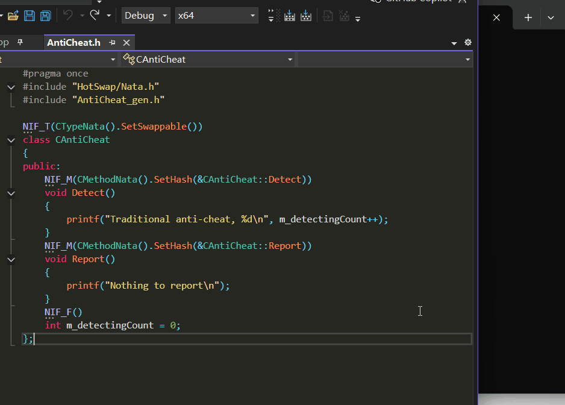
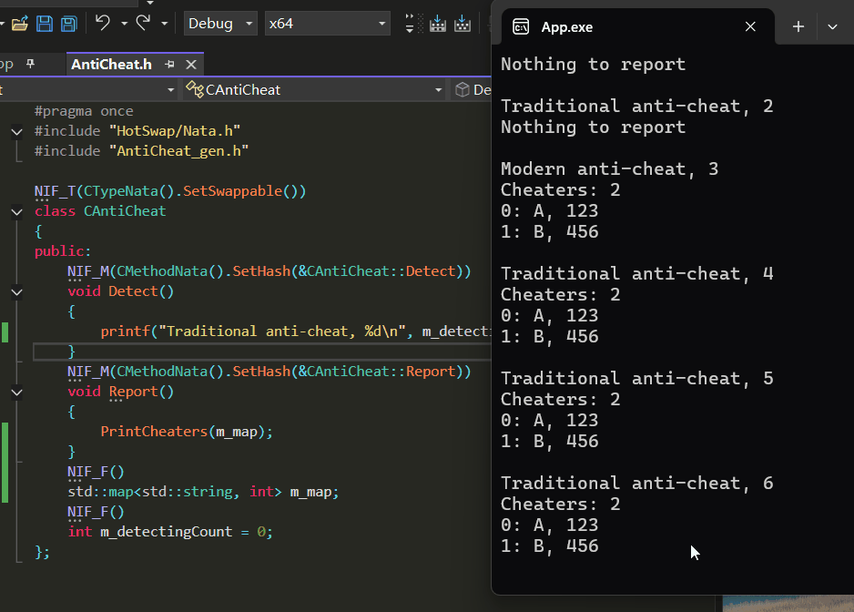

[中文](../../README.md)

# Niflect Sample: Reflection-Driven Native-Level Instance Hot-Swapping Framework

**NiflectSampleHotSwap** is a C++ demonstration of reflection metadata-driven instance hot-swapping, showcasing runtime instance replacement without application restart and state migration between old/new instances. "Native-level" means:

- Function execution performance matches native code
- Maintains native C++ development paradigms

Reflection metadata required for hot-swapping is generated by Niflect.

**Niflect** is a native C++-style reflection framework. See [introduction](https://github.com/sainimu78/NiflectSampleHelloWorld)

## Features

- No base class inheritance required - See `class CAntiCheat`
- State migration between old/new instances - See `SaveAndDestroy` and `CreateAndMigrate`
- Memory layout and vtable independent - Freely add/remove fields/functions
- Native-level function execution - See `InvokeBestPractice`
- Signature-based dynamic address binding - Enables elegant late binding of interfaces - See `FindMethodSignatureHash`
- Signature safety (Prevents crashes when method signatures change) and extensible argument passing (Single-Argument Erasure for Type-Safe Invocation) - See `InvokeBestPractice` and `CAntiCheat::Detect(CDetectingContext& ctx)`
- Automatic discovery of swappable types - See `CRunTimeModule::Load`

## Demos

### 1. Hot-Swapping


*Workflow*
- App.exe (a console application) remains running
- Define `CAntiCheat` class/members using Niflect macros and custom Nata tags of this demo
- Modify plugin code in AntiCheat.h and rebuild AntiCheat.dll
- Press Enter in the App.exe window to hot-swap `CAntiCheat` instance
- Invoke `Detect` and `Report` methods after swapping

### 2. State Migration Between Instances



*State Migration Process*
- During hot-swap in App.exe:
  - Old instance state is saved and destroyed
  - New instance is created and initialized with saved state
- `m_detectingCount` increments when calling `Detect` on new instance

### 3. Inserting Fields


*Hot-Fix Simulation Workflow*
- Add `m_map` field using macro tags and utilize it in `Detect`
  - Implemented serialization for `std::map` enables state migration
- Observe successful insertion after hot-swapping in App.exe

### 4. State Preservation


*Hot-Fix Simulation Workflow*
- Remove `m_map`-related code from `Detect`
- Observe `m_map` preserves state after hot-swapping in App.exe

### 5. Deleting Fields



*Hot-Fix Simulation Workflow*
- Remove `m_map` field and `m_detectingCount++` from `Detect`
- Observe `m_detectingCount` preserves state after hot-swapping in App.exe

## Building

```bash
git clone git@github.com:sainimu78/NiflectSampleHotSwap.git
cd NiflectSampleHotSwap
git submodule update --init --remote
```

### Windows

Plugin

```bat
cd Build\Plugin\Windows
Generate.bat
Build.bat
```

App

```bat
cd Build\App\Windows
Generate.bat
Build.bat
DefaultBuild\Debug\bin\App.exe
```

### Linux

Plugin

```bash
cd Build/Plugin/Linux
./Generate.sh
./Build.sh
```

App

```bash
cd Build/App/Linux
./Generate.sh
./Build.sh
./DefaultBuild/Debug/bin/App
```

## FAQ

### Q1: Does it support changing field types while keeping names?

#### A1: Not currently. But achievable through custom migration methods in the framework.

This is planned for a future demonstration

### Q2: How does this differ from script-based dynamic approaches?

#### A2: After hot-swapping completes, execution performance equals native code. Key differences:

Directly reuses existing reflection infrastructure for core C++ types (e.g., serialization systems and editors), eliminating the need for script-specific architectures

### Q3: Is module reloading inefficient for real-time scenarios?

#### A3: The demo approach blocks the main thread and isn't real-time ready. Important clarification:

Module reloading syscalls can be executed in background threads and asynchronous hot-swapping is achievable for real-time systems

This is planned for a future demonstration

### Q4: How to handle hot-swapping with complex instance dependencies?

#### A4: Requires runtime dependency graphs between classes/instances:

Reflection metadata enables dependency graph construction therefore correct swapping sequence can be generated based on dependencies, but this solution probably introduces swap latency and complexity

### Q5: What's the difference between module-reloading and JIT hot-swapping?

#### A5: Module reloading is optional in this architecture:

The core innovation is metadata-driven swapping, not the loading mechanism. Additionally, a hybrid module + JIT architecture is feasible

- Integrating Niflect into JIT workflow (e.g., clang-repl)
- This approach could be achieved by JIT-compiling and updating reflection metadata

