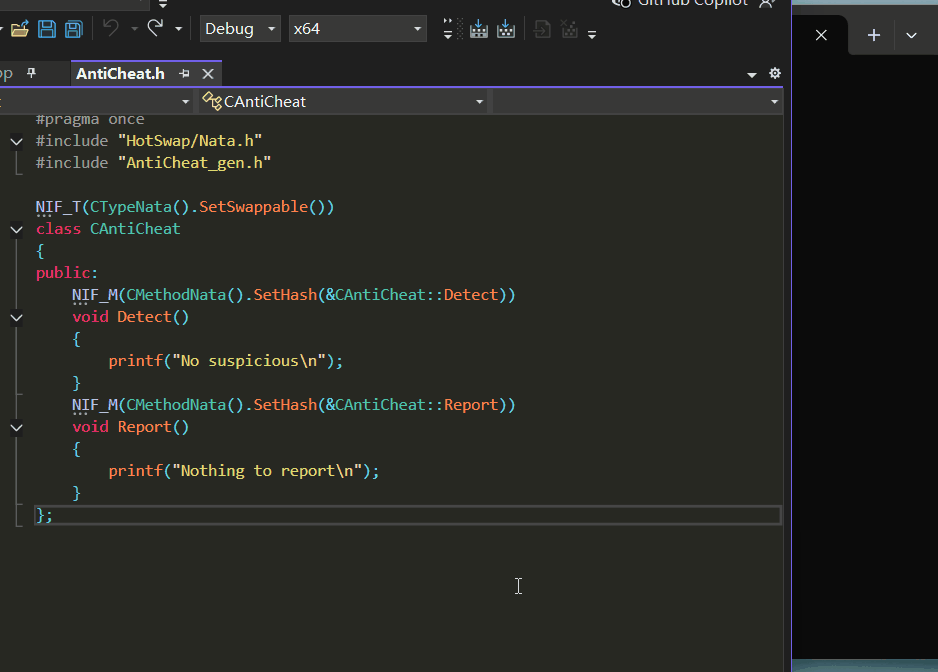

[English](Doc/English/README.md)

# Niflect 示例: 反射驱动的原生级实例热替换框架

**NiflectSampleHotSwap** 是 C++ 基于反射元数据的实例热替换示例, 展示如何不重启应用实现运行时替换实例, 新旧实例状态迁移等. 原生级体现如下

- 函数执行性能达原生级
- 开发风格保持原生性

热替换所需的反射元数据通过 Niflect 生成

**Niflect** 是一款 C++ 原生风格反射框架, 详见[介绍](https://github.com/sainimu78/NiflectSampleHelloWorld)

## 特性

- 不要求可被替换的类继承自某个类, 见 `class CAntiCheat`
- 新旧实例状态迁移, 见 `SaveAndDestroy` 与 `CreateAndMigrate`
- 与布局, 虚表无关, 可任意增删字段与函数
- 函数执行达原生级性能, 见 `InvokeBestPractice`
- 函数参数类型擦除且参数可扩展的类型安全函数调用机制 (Single-Argument Erasure for Type-Safe Invocation), 见 `InvokeBestPractice`
- 基于函数签名的动态地址绑定机制, 优雅实现接口延迟绑定, 见 `FindMethodSignatureHash`
- 确保仅执行符合接口约定的函数, 修改函数签名不崩溃, 见 `CAntiCheat::Detect(CDetectingContext& ctx)`
- 自动发现可热替换类型, 见 `CRunTimeModule::Load`

## 演示

### 1. 热替换



*工作流*

- App.exe (控制台应用) 始终保持运行
- 使用 Niflect 的宏标签和本示例自定义的热替换 Nata 定义 `CAntiCheat` 示例类与成员
- 修改 AntiCheat.h 插件代码后构建生成 AntiCheat.dll
- 在 App.exe 窗口中按回车, 热替换所修改的 `CAntiCheat` 类实例
- 热替换后分别执行实例的 `Detect` 与 `Report`

### 2. 新旧实例状态迁移


*状态迁移过程*

- App.exe 中热替换前后
  - 旧实例保存状态后删除
  - 创建新实例后从保存状态中载入
- 在新实例执行 `Detect` 时累加计数字段 `m_detectingCount`

### 3. 插入字段


*模拟的热修复工作流*

- 使用宏标签定义 `m_map` 并相应在 `Detect` 中使用该字段
  - 示例中已预先定义 `std::map` 的序列化方法以实现此类型字段的状态迁移
- App.exe 中热替换后可观察到成功插入 `std::map` 的字段

### 4. 保持状态


*模拟的热修复工作流*

- 删除 `Detect` 中与 `m_map` 相关的代码
- App.exe 中热替换后可观察到 `m_map` 保持之前的状态

### 5. 删除字段


*模拟的热修复工作流*

- 删除 `m_map` 字段, 移除 `Detect` 中对 `m_detectingCount` 的 `++` 操作
- App.exe 中热替换后可观察到 `m_detectingCount` 保持之前的状态

## 构建

```bat
git clone git@github.com:sainimu78/NiflectSampleHotSwap.git
cd NiflectSampleHotSwap
git submodule update --init --remote
```

### Windows

Plugin

```bat
cd Build\Plugin\Windows
Generate.bat
Build.bat
```

App

```bat
cd Build\App\Windows
Generate.bat
Build.bat
cd DefaultBuild\Debug\bin
App.exe
```

### Linux

Plugin

```
cd Build/Plugin/Linux
./Generate.sh
./Build.sh
```

App

```
cd Build/App/Linux
./Generate.sh
./Build.sh
cd DefaultBuild/Debug/bin
./App
```

## FAQ

### Q1: 支持同名字段改类型吗?

#### A1: 不支持. 但能够支持, 只需要在框架中支持自定义迁移方法即可

这是本示例计划实现的演示之一

### Q2: 与用脚本实现的动态性有何区别?

#### A2: 显著区别即在于, 一旦热替换完成后, 本方法几乎等同于原生代码的执行性能. 潜在的巨大区别说明如下

为核心 C++ 类型实现的反射基础设施可直接复用, 常见的基础设施如序列化与编辑器等, 并且不需要再为接入脚本而另定架构

### Q3: 基于模块重载方法本身是低效的, 可以认为不能用于实时场景吗?

#### A3: 示例中的做法阻塞主线程, 不能直接用于实时场景. 但须澄清说明如下

重载模块本身确实低效, 但模块重载的系统调用是可以在线程中执行的. 因此对于实时性要求的应用, 是能够实现异步热替换流程的, 这是本示例计划实现的演示之一

### Q4: 如果实例间存在复杂依赖关系, 应如何热替换?

#### A4: 这涉及类与类, 类与实例的运行时依赖图.

基于反射元数据可建立依赖图, 建立后, 根据依赖关系即可实现正确的替换流程, 但这很可能意味着替换操作延迟与高度复杂的流程.

### Q5: 模块重载的热替换与 JIT 的热替换有哪些区别?

#### A5: 实际上模块重载并不是本方法的必要流程, 因此澄清说明如下

首先, 模块重载与 JIT 的混合热替换架构本身就是可行的, 而本方法的关键在于对反射元数据的使用, 而非模块重载, 实际上本方法的模块重载是可改用 JIT 编译的, 二者无冲突.

目前评估的可行性如下

- 将 Niflect 设法集成到 JIT 编译环境中, 例如集成到 clang-repl 的编译环境
- 反射元数据通过 JIT 替换, 即可实现本热替换方法
